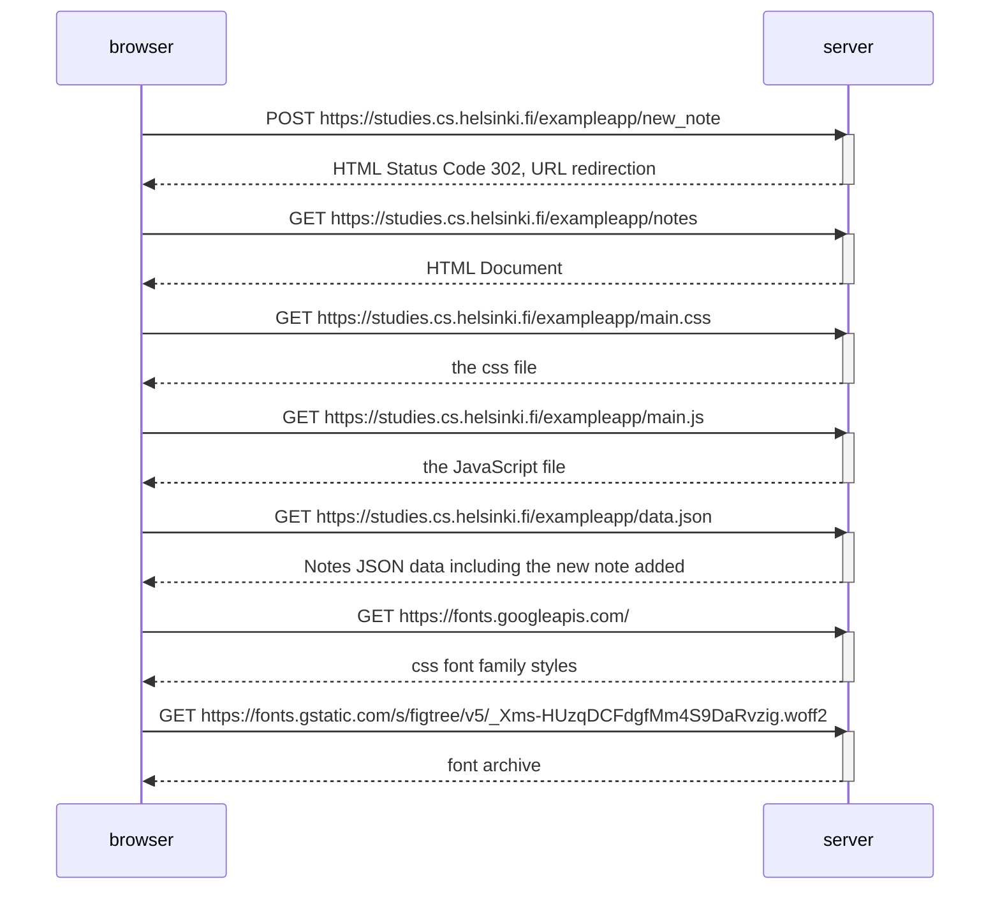

```mermaid
sequenceDiagram
    participant browser
    participant server
    
    browser->>server: POST https://studies.cs.helsinki.fi/exampleapp/new_note 
    activate server
    server-->>browser: HTML Status Code 302, URL redirection
    deactivate server

    browser->>server: GET https://studies.cs.helsinki.fi/exampleapp/notes
    activate server
    server-->>browser: HTML Document
    deactivate server
    
    browser->>server: GET https://studies.cs.helsinki.fi/exampleapp/main.css
    activate server
    server-->>browser: the css file
    deactivate server
    
    browser->>server: GET https://studies.cs.helsinki.fi/exampleapp/main.js
    activate server
    server-->>browser: the JavaScript file
    deactivate server
        
    browser->>server: GET https://studies.cs.helsinki.fi/exampleapp/data.json
    activate server
    server-->>browser: Notes JSON data including the new note added
    deactivate server   

    browser->>server: GET https://fonts.googleapis.com/
    %https://fonts.googleapis.com/css2?family=Figtree:ital,wght@0,300;0,400;0,500;0,600;0,700;0,800;0,900;1,300;1,400;1,500;1,600;1,700;1,800;1,900&display=swap
    activate server
    server-->>browser: css font family styles
    deactivate server

    browser->>server: GET https://fonts.gstatic.com/s/figtree/v5/_Xms-HUzqDCFdgfMm4S9DaRvzig.woff2
    activate server
    server-->>browser: font archive
    deactivate server    

```

